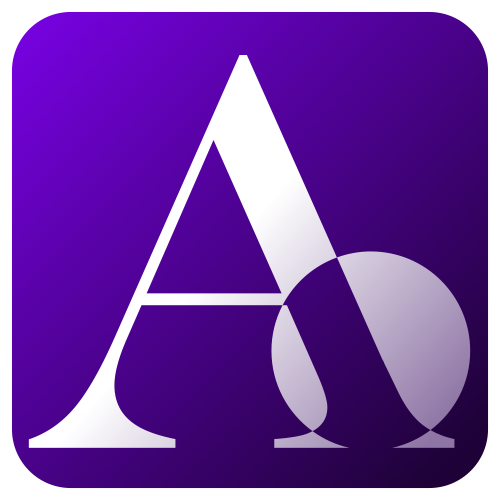

# The Archivist 

A Chrome extension that allows you to quickly access the latest archived version of any webpage using [archive.ph](https://archive.ph).
With a single click, the extension redirects the current page to its archive (if it exists).

_This extension was created as a way to explore how Chrome extensions work, and as a technical exercise to improve my development skills._

---

## 🛠 Tech Stack
**Language:**

---

🔗 Links

